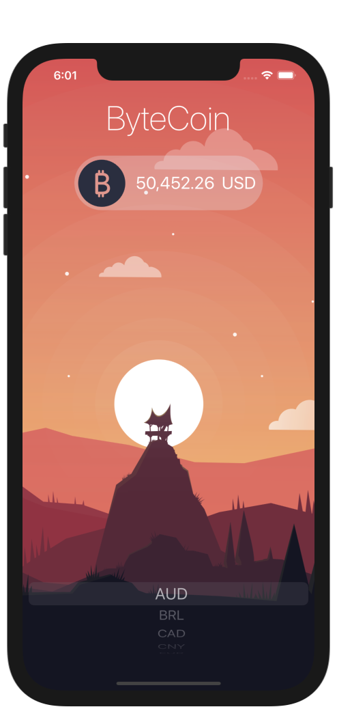
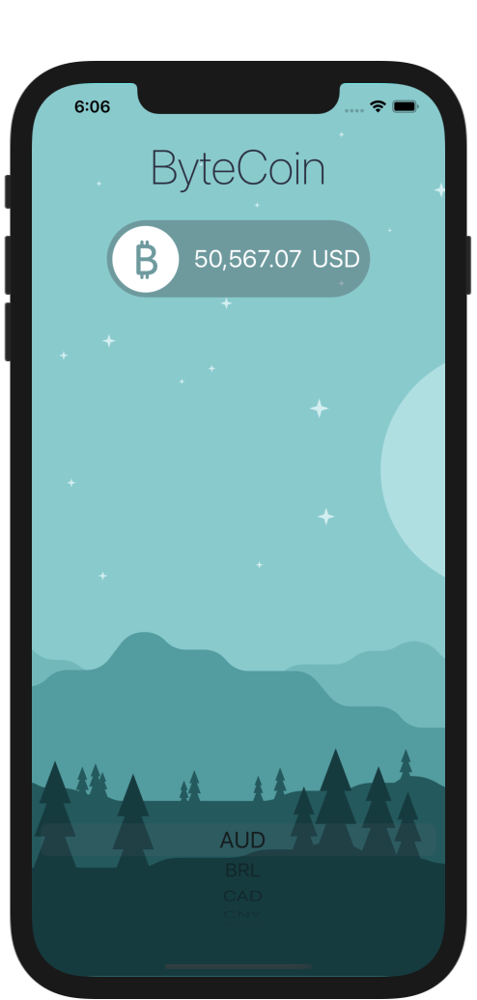
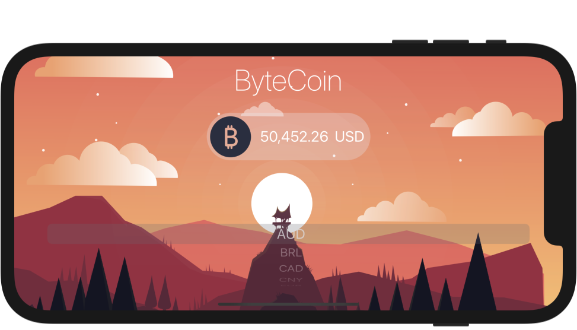
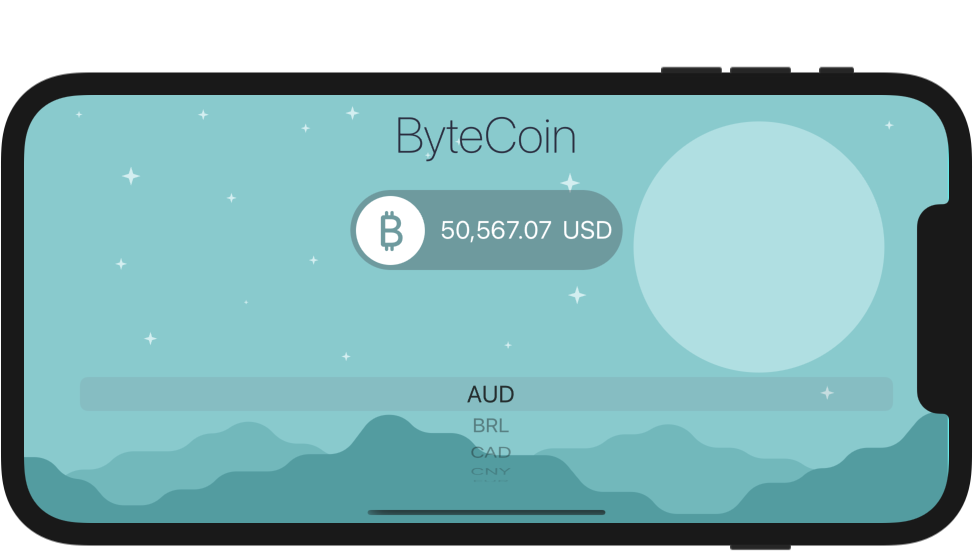
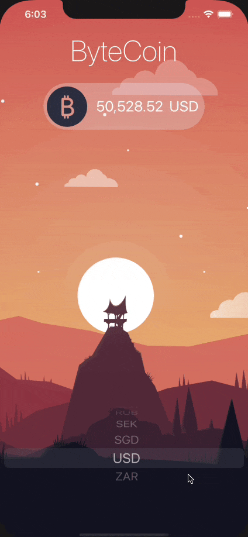

# Bitcoin-Price-Tracker
### Screen Shots

---

### Table of Contents

- [Description](#description)
- [How To Use](#how-to-use)
- [Author Info](#author-info)

## Description

- Live Bitcoin Price tracking app which fetches data from coinapi.io

---

### What I Learned:

- Extended knowledge about the delegate pattern.
- Swift protocols and extensions.
- Learn to use URLSession to network and make HTTP requests.
- Parse JSON with the native Encodable and Decodable protocols.
- Learn to use api keys.
- Learn UIPickerViewDelegate & UIPickerViewDataSource

---

## How To Use

- Clone the project and run it on Xcode
---

## Author Info
- Website - [LinkedIn: Gurpreet Singh](https://www.linkedin.com/in/gurpreet-singh-a2651b107/)

[Back To The Top](#Bitcoin-Price-Tracker)
